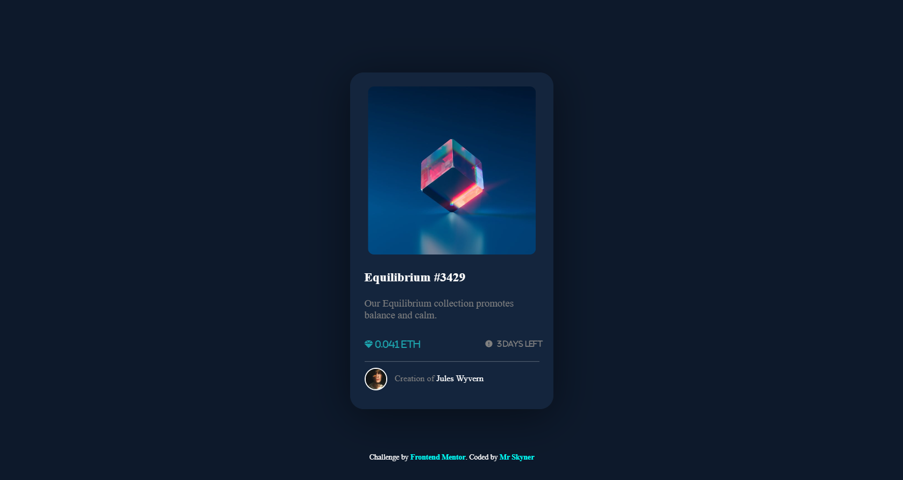

# Frontend Mentor - NFT preview card component solution

This is a solution to the [NFT preview card component challenge on Frontend Mentor](https://www.frontendmentor.io/challenges/nft-preview-card-component-SbdUL_w0U). Frontend Mentor challenges help you improve your coding skills by building realistic projects. 

## Table of contents

- [Overview](#overview)
  - [The challenge](#the-challenge)
  - [Screenshot](#screenshot)
  - [Links](#links)
- [My process](#my-process)
  - [Built with](#built-with)
  - [What I learned](#what-i-learned)
  - [Continued development](#continued-development)
- [Author](#author)
- [Acknowledgments](#acknowledgments)

**Note: Delete this note and update the table of contents based on what sections you keep.**

## Overview

### The challenge

Users should be able to:

- View the optimal layout depending on their device's screen size
- See hover states for interactive elements

### Screenshot



### Links

- Solution URL: (https://subclavicular-purch.000webhostapp.com/)
- Live Site URL: (https://subclavicular-purch.000webhostapp.com/)

## My process

### Built with

- VS Code

### What I learned


```html
<h1>Some HTML code I'm proud of</h1>
```
```css {
    position: fixed;
    inset: 0;
    margin: auto;


```i-credit img 
    width: 30px;
    height: 30px;
    transform: translate(-20px, -20px);


```i-credit .border 
    border: 2px solid;
    border-radius: 50px;
    border-color: white;
    width: 30px;
    height: 30px

```
### Continued development

Next time i want to focus on learning more coding with css and make it more clean and also to learn how to do more things which i didn't do on this project (hovering view on image) 

## Author

- Frontend Mentor - [@MrSkyner](https://www.frontendmentor.io/profile/MrSkyner)

## Acknowledgments

- I take a small trick from this yt channel (to make card correctly visible on all devices) - https://www.youtube.com/watch?v=HOM47v73yG8

